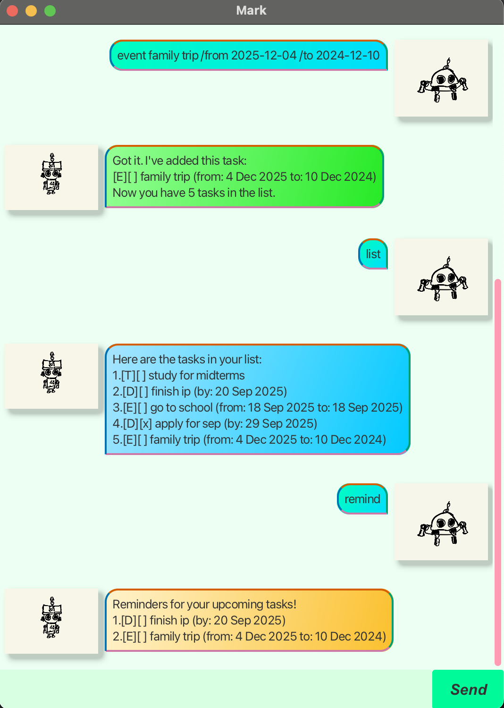

# Mark User Guide

---



Welcome to Mark, your personal task manager! 
Mark helps you organize and track your tasks effortlessly. 
With a simple, intuitive interface, Mark can add tasks, set deadlines, 
and even Mark and unmark completed tasks!

---

# Features

## Adding Todos

Add a basic task that has a name.

Format: `todo TASK`

Example: `todo read book`


```
Got it. I've added this task:
[T][] read book
Now you have 1 task in the list.
```
---

## Adding Deadlines

Add a deadline task that has a name and a deadline.

Format: `deadline TASK /by DATE`

Example: `deadline return book /by 2025-09-20`


```
Got it. I've added this task:
[D][] return book (by: 20 Sep 2025)
Now you have 2 tasks in the list.
```
---

## Adding Events

Add a event task that has a name and a from and to date.

Format: `event TASK /from DATE /to DATE`

Example: `event tp project discussion /from 2025-09-20 /to 2025-09-20`


```
Got it. I've added this task:
[E][] tp project discussion (from: 20 Sep 2025 to: 20 Sep 2025)
Now you have 3 tasks in the list.
```

---

## Listing Tasks

List out all your tasks

Format: `list`

```
Here are the tasks in your list:
1. [T][] read book
2. [D][] return book (by: 20 Sep 2025)
3. [E][] tp project discussion (from: 20 Sep 2025 to: 20 Sep 2025)
```
---

## Unmarking Tasks

Unmark a specific task as not completed.

Format: `unmark INDEX`

Example: `unmark 2`

```
OK, I've marked this task as not done yet:
[D][] return book (by: 20 Sep 2025)
```

---

## Marking Tasks

Mark a specific task as completed.

Format: `unmark INDEX`

Example: `mark 2`

```
Nice! I've marked this task as done:
[D][X] return book (by: 20 Sep 2025)
```
---
## Deleting Tasks

Deletes a specific task.

Format: `delete INDEX`

Example: `delete 1`

```
OK, I've deleted this task:
[T][] read book
```

---
## Find Tasks

Finds a task by part of its name.

Format: `find SUBSTRING`

Example: `find book`

```
Here are the matching tasks in your list:
1. [D][] return book (by: 20 Sep 2025)
```

---
## Reminder

Remind what tasks are not completed and upcoming.
Automatically runs on app launch also.

Format: `remind`

```
Reminders for your upcoming tasks!
1. [E][] tp project discussion (from: 20 Sep 2025 to: 20 Sep 2025)
```

---
## Exit App

Exits the app

Format: `bye`


